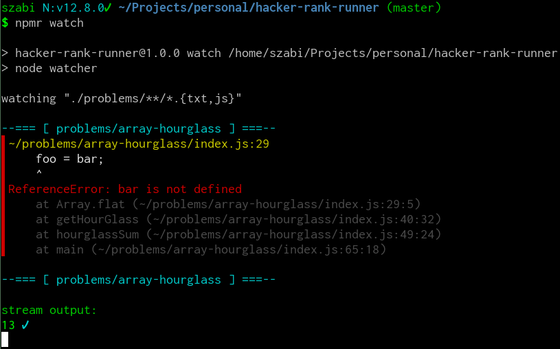

# Hacker rank runner

Run and debug [HackerRank](https://www.hackerrank.com/) tests from node proper.

Be sure to check HR's [node version](https://www.hackerrank.com/environment), which
is **10.16.3** as of this writing (same as the one in the local [nvmrc](./.nvmrc)).

## Usage

1. clone project
2. `npm i`
3. create folder `foo` in _problems_, paste foo test contents as `index.js`,
   enter input to `input.txt`
4. **single call:** `node runner problems/foo`  
   **watcher:** `node watcher`
5. joy

## Why

There's only **basic expected output** comparison, the runner will print
the output of the script (be it a stream or plain stdout), but mostly it's
up to you to decide whether that's the value you're looking for
or not.

Debug with console logs, breakpoints or whatever you want, it's
meant to be more comfortable and faster than HackerRank's web app.
